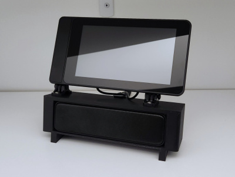
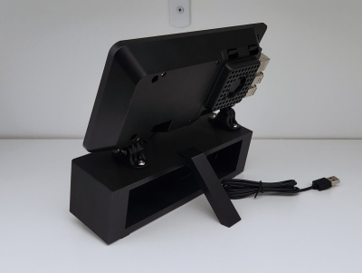
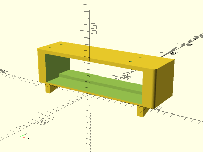
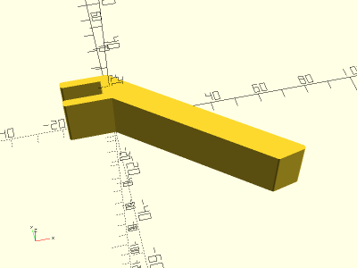

# SmartiPi Touch 2 Speaker Dock

<table>
<tr>
<td></td>
<td></td>
</tr>
<tr>
<td></td>
<td></td>
</tr>
</table>

A speaker dock for the [SmartiPi Touch 2 case](https://smarticase.com/products/smartipi-touch-2) and a [7.2 inch USB speaker](https://www.amazon.com/gp/product/B086JXJ1LF/) that prints with no supports. Includes an anti-tip bracket. Case is attached to the dock with four M4x8 bolts and M4 nuts. Made with OpenSCAD.

**Design:** [smartipi_touch_2_speaker_dock.scad](smartipi_touch_2_speaker_dock.scad)

**STLs:**

* [smartipi_touch_2_speaker_dock.stl](stl/smartipi_touch_2_speaker_dock.stl)
* [smartipi_touch_2_speaker_dock_antitip.stl](stl/smartipi_touch_2_speaker_dock_antitip.stl)

**Recommended Print Settings:** PLA+, 0.20mm layer height, 10% infill, no supports. Print dock vertically (rear on build plate).

**Thingiverse:** https://www.thingiverse.com/thing:6085469

**License**: 
